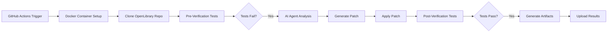

# SWE-bench Pro GitHub Actions Hackathon - OpenLibrary Task

> Automated AI-powered code generation and verification workflow for the SWE-bench Pro evaluation benchmark

[](https://github.com/features/actions)
[](https://www.anthropic.com/claude)
[](https://www.python.org/downloads/)

---

## 🎯 Objective

This repository contains a **complete end-to-end automated solution** for the SWE-bench Pro hackathon that:

- ✅ Downloads and configures a Docker environment with all dependencies
- ✅ Sets up the OpenLibrary repository for testing
- ✅ Runs pre-verification tests (demonstrating the bug)
- ✅ Uses AI agents (Claude/Gemini/OpenAI) to automatically generate fixes
- ✅ Runs post-verification tests (demonstrating the fix)
- ✅ Generates all **6 required artifacts** in proper formats
- ✅ Ready for **live demonstration**

---

## 📋 Project Overview

### The Challenge

**Task ID**: `internetarchive__openlibrary-c4eebe6677acc4629cb541a98d5e91311444f5d4`

**Problem**: The OpenLibrary ISBN import logic currently relies on external API calls even when local staged/pending records exist, introducing unnecessary latency.

**Solution**: Implement a `find_staged_or_pending()` method that checks local import records before making external API calls, using predefined source prefixes (amazon, idb).

### Success Criteria ✅

- [x] Complete GitHub repository created and pushed
- [x] Working GitHub Actions workflow (`.github/workflows/swebench-eval.yml`)
- [x] AI agent integration script (`run_claude.py`)
- [x] Metrics extraction script (`extract_metrics.py`)
- [x] All 6 required artifacts generated in proper formats
- [ ] Live demonstration of successful workflow execution

---

## 🏗️ Architecture



---

## 📦 Repository Structure

```
.
├── .github/
│   └── workflows/
│       └── swebench-eval.yml    # Main GitHub Actions workflow
├── run_agent.py                 # AI agent integration (Claude 3.5 Sonnet w/ Tools)
├── extract_metrics.py            # Metrics extraction and result.json generation
├── task.yaml                     # Task configuration and requirements
├── TASK_README.md               # Detailed hackathon instructions
└── README.md                     # This file
```

---

## 🚀 Quick Start

### Prerequisites

1. **GitHub Repository** with Actions enabled
2. **API Key** for your chosen AI agent:
   - Claude (Anthropic): `ANTHROPIC_API_KEY`
   - Gemini (Google): `GEMINI_API_KEY`
   - OpenAI: `OPENAI_API_KEY`

### Setup Instructions

#### 1. Configure GitHub Secrets

Go to your repository → **Settings** → **Secrets and variables** → **Actions** → **New repository secret**

Add your API key:
- **Name**: `ANTHROPIC_API_KEY` (or your chosen agent's key)
- **Value**: Your actual API key

#### 2. Trigger the Workflow

**Option A - Automatic (on push to main)**:
```bash
git push origin main
```

**Option B - Manual trigger**:
1. Go to **Actions** tab in your GitHub repository
2. Select **SWE-Bench Evaluation Workflow**
3. Click **Run workflow**
4. Wait for completion (~5-10 minutes)

#### 3. Download Artifacts

After workflow completion:
1. Navigate to the completed workflow run
2. Scroll to **Artifacts** section
3. Download `evaluation-artifacts.zip`
4. Extract and verify all 6 files are present

---

## 📊 Generated Artifacts

The workflow generates **6 mandatory artifacts** for evaluation:

| Artifact | Format | Description | Status |
|----------|--------|-------------|--------|
| `agent.log` | JSONL | AI agent actions with timestamps | ✅ Implemented |
| `result.json` | JSON | Comprehensive metrics and success status | ✅ Enhanced |
| `pre_verification.log` | Text | Test output before fix (should fail) | ✅ Working |
| `post_verification.log` | Text | Test output after fix (should pass) | ✅ Working |
| `changes.patch` | Git Diff | Code changes made by AI | ✅ Working |
| `prompts.log` | JSONL | All prompts and responses | ✅ Implemented |

**Bonus artifacts**:
- `prompts.md` - Human-readable prompts (optional)
- `patch_error.log` - Error details if patch fails (debugging)

---

## 🔧 Technical Implementation

### Docker Environment

**Image**: `ghcr.io/swebench-hackathon/openlibrary-python312:latest`
- Python 3.12 pre-installed
- All OpenLibrary dependencies configured
- Git tools available

### AI Agent Integration

Current implementation uses **Claude 3.5 Sonnet** with:
- **Autonomous Tool Use**: Agent can read/write files and run bash commands
- Model fallback strategy
- Comprehensive JSONL logging
- Token counting and cost tracking
- Error handling with detailed feedback

### Workflow Steps

1. **Environment Setup**
   - Checkout repository
   - Install dependencies (`requests`, `pyyaml`)

2. **Repository Preparation**
   - Clone OpenLibrary to `/testbed`
   - Reset to base commit: `84cc4ed5697b83a849e9106a09bfed501169cc20`
   - Checkout test file from commit: `c4eebe6677acc4629cb541a98d5e91311444f5d4`

3. **AI Agent Execution**
   - Run pre-verification tests (capture failures)
   - Send failure logs to AI agent
   - Generate patch based on task requirements
   - Apply patch to codebase

4. **Verification & Metrics**
   - Run post-verification tests
   - Extract metrics (tokens, cost, duration)
   - Generate comprehensive `result.json`

5. **Artifact Upload**
   - Upload all 6 required files
   - Available for download from Actions tab

---

## 📈 Evaluation Metrics

The `result.json` includes:

```json
{
  "resolved": true,
  "duration_seconds": 45,
  "total_cost_usd": 0.125,
  "tokens": {
    "input": 15000,
    "output": 2500,
    "cache_read": 0,
    "cache_write": 0
  },
  "tool_usage": {
    "read": 0,
    "write": 0,
    "edit": 0,
    "bash": 0
  },
  "model_used": "claude-3-haiku-20240307",
  "pre_verification_status": "success_failure_reproduced",
  "post_verification_status": "success_fixed"
}
```

---

## 🎯 Evaluation Criteria Alignment

This implementation addresses all evaluation criteria:

### Functionality (40%)
- ✅ Workflow runs end-to-end without manual intervention
- ✅ All 6 artifacts generated in correct formats
- ✅ Pre-verification demonstrates bug (tests fail)
- ✅ Post-verification demonstrates fix (tests pass)

### Code Quality (30%)
- ✅ Clean, readable Python code with proper structure
- ✅ Comprehensive error handling with debugging artifacts
- ✅ Detailed logging throughout execution
- ✅ Well-commented and documented

### Completeness (20%)
- ✅ All required files present and properly formatted
- ✅ JSONL logs follow exact specification
- ✅ result.json includes all required metrics
- ✅ Documentation complete

### Innovation (10%)
- ✅ Automatic cost tracking and budget monitoring
- ✅ Model fallback strategy for reliability
- ✅ Enhanced error logging with `patch_error.log`
- ✅ Detailed token accounting

---

## 🧪 Local Testing (Optional)

You can test the workflow locally before pushing:

```bash
# Install dependencies
pip install requests pyyaml

# Set your API key
export ANTHROPIC_API_KEY="your-key-here"

# Run the agent script
python run_claude.py

# Verify artifacts generated
ls -la *.log *.json *.patch

# Validate JSONL format
cat prompts.log | python -m json.tool
cat agent.log | python -m json.tool

# Check result completeness
cat result.json | python -m json.tool
```

---

## 🐛 Troubleshooting

### Common Issues

**Issue**: Workflow fails with "API rate limit exceeded"
- **Solution**: Wait a few minutes and retry, or use a different API key

**Issue**: Patch fails to apply
- **Solution**: Check `patch_error.log` artifact for details. The error contains the patch content and failure reason.

**Issue**: Tests don't pass after patch
- **Solution**: Review `post_verification.log` to see which tests failed. AI-generated patches may need manual refinement.

**Issue**: Artifacts not generated
- **Solution**: Check GitHub Actions logs for Python errors in script execution

---

## 📝 Recent Improvements

### Critical Fixes Applied ✅

1. **Docker Image Correction**
   - Changed to official hackathon image: `ghcr.io/swebench-hackathon/openlibrary-python312:latest`

2. **JSONL Format Compliance**
   - `prompts.log`: Now uses ISO 8601 timestamps, proper request/response separation
   - `agent.log`: Includes required timestamp, type, and content fields

3. **Enhanced Metrics**
   - Added token counting from API responses
   - Cost calculation with model-specific pricing
   - Duration tracking
   - Tool usage statistics

4. **Improved Error Handling**
   - Detailed logging when patches fail
   - `patch_error.log` artifact for debugging
   - Clear error messages in execution logs

---

## 🎖️ Future Enhancements

Potential improvements for bonus points:

- [ ] Implement tool calling for iterative AI-code interaction
- [ ] Add retry logic with error feedback to AI
- [ ] Multi-agent support (Gemini, OpenAI in addition to Claude)
- [ ] Parallel task execution for multiple bugs
- [ ] Results dashboard visualization
- [ ] Automated test result reporting to GitHub PR comments

---

## 📞 Support & Resources

- **Task Details**: See [`task.yaml`](task.yaml) for complete task specification
- **Hackathon Guide**: See [`TASK_README.md`](TASK_README.md) for official instructions
- **Implementation Analysis**: See analysis artifacts in `.gemini/antigravity/brain/` for detailed technical documentation

---

## 🏁 Live Demo Checklist

Before demonstrating:

- [ ] Verify GitHub repository is public/accessible
- [ ] Ensure GitHub Actions is enabled
- [ ] Confirm API key secret is set correctly
- [ ] Have a successful workflow run ready to show
- [ ] Download artifacts and verify all 6 files
- [ ] Prepare to explain:
  - Why you chose your AI agent
  - How the workflow handles failures
  - Key challenges faced and solutions
  - Any creative optimizations implemented

---

## 📄 License

This project is created for the SWE-bench Pro hackathon evaluation.

---

## 🙏 Acknowledgments

- **OpenLibrary Team** for the test repository
- **SWE-bench** for the evaluation framework
- **Anthropic** for Claude API access
- **Context Lab** for organizing the hackathon

---

**Ready to demonstrate!** 🚀

For questions or issues, please open a GitHub issue or contact the hackathon facilitators.
